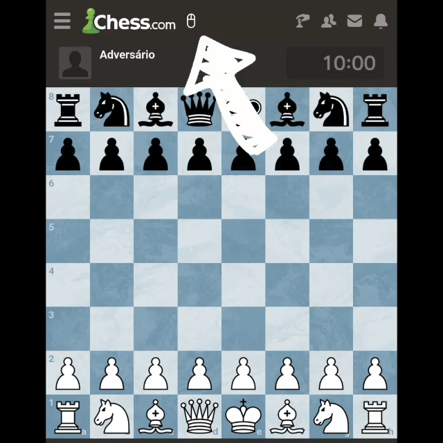

# ♟️ Chess Arrows Mobile

Draw arrows on Chess.com from your phone.

This extension allows you to draw arrows on Chess.com mobile by emulating right-click interactions in browsers that support extensions.

## ✨ Perfect for

- 📚 Study positions
- 🧠 Analyze moves
- 🎯 Highlight ideas
- 📱 Get a desktop-like experience on mobile

## 🕹️ Usage

Tap the mouse icon to enable the extension.

While enabled, your touches emulate right-click interactions, allowing you to draw arrows on the board.

Tap the icon again to disable it.

## 🎬 Demo

  

## 🚀 Installation

### 🌐 Lemur Browser (Recommended)

- Download the latest release
- Open Extensions
- Enable **Developer Mode**
- Tap **Load ZIP**
- Select the extension file

### 🦊 Firefox

- Coming soon™

## 🔒 Privacy

✅ No data collection  
✅ No tracking  
✅ Lightweight

## 📜 License

MIT
